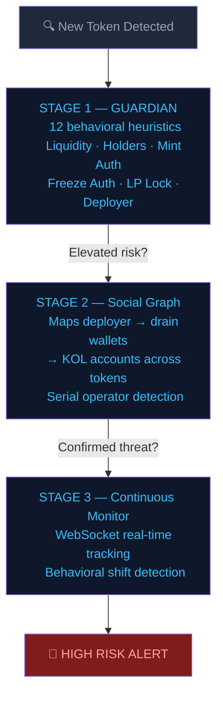

# SolSentry 🛡️
### Solana Threat Intelligence — Operator-Level Rug Pull Detection

> **"The 62nd token looked clean. The operator's history didn't."**

SolSentry is a Solana threat intelligence system that tracks **operators**, not just tokens.  
While existing tools (RugCheck, GoPlus, DEXScreener) analyze each token in isolation, SolSentry maps the wallets behind them — across deployments, over time.

---

## The Problem

Serial rug pull operators deploy dozens of scam tokens from the same wallet cluster.  
Each new token looks clean on launch. The threat signal lives in the operator's history — invisible to every per-token tool on the market.

---

## How It Works

---

## Case Study — Operator 4kxscute

On **March 12, 2026**, SolSentry's social graph flagged deployer wallet `4kxscute` as a serial operator.

| Event | Time |
|---|---|
| Token #62 deployed by 4kxscute | T+0:00 |
| SolSentry HIGH RISK alert issued | **T+0:04** |
| Token appears on aggregator risk radar | T+0:27 |
| Rug pull executed | **T+0:23** |

The token had **clean static metadata at launch**.  
The threat signal was in the operator's history across 61 prior confirmed rug pulls — not in the token itself.

> SolSentry alerted **19 minutes before the rug pull** — based entirely on operator pattern, not token metadata.

---

## Current Metrics

| Metric | Value |
|---|---|
| Token scans executed | 5,067 |
| Token discoveries (monitored) | 240,618 |
| Tokens flagged elevated risk | 4,088 |
| Predictions resolved | 593 |
| Correct predictions | **573 (96.6%)** |
| False positives | **0** |
| Bot/shill clusters identified | 229 |
| KOL accounts tracked | 106 |
| Connected operator wallets mapped | 847 |

---

## GUARDIAN — The Scoring Engine

GUARDIAN uses a **genetic algorithm** to continuously optimize the weights of its 12 detection heuristics.  
Mutation rate is fitness-gated — genes only mutate when accuracy drops below threshold, preventing drift during stable performance periods.

**Example gene:** `max_hunters` — governs the threshold for flagging suspicious buy-side concentration clustering.

---

## What Doesn't Exist Anywhere Else on Solana

| Capability | RugCheck | GoPlus | DEXScreener | **SolSentry** |
|---|:---:|:---:|:---:|:---:|
| Token-level analysis | ✅ | ✅ | ✅ | ✅ |
| Operator tracking (cross-token) | ❌ | ❌ | ❌ | ✅ |
| Serial deployer detection | ❌ | ❌ | ❌ | ✅ |
| Social graph mapping | ❌ | ❌ | ❌ | ✅ |
| Drain wallet linkage | ❌ | ❌ | ❌ | ✅ |
| KOL correlation tracking | ❌ | ❌ | ❌ | ✅ |

---

## Technical Stack

- **Language:** Python (full async architecture)
- **RPC:** Helius + Alchemy (RPC Node, WebSocket Streaming, Enhanced APIs)
- **Data:** Solscan API · PostgreSQL
- **Testing:** 218 tests · 9 test files · 91 commits

---

## Roadmap

**Q2 2026** — Public API launch (freemium) · WebSocket Stage 3 · Stealth rug fix  
**Q3 2026** — React dashboard (drain map, operator timeline, heat map) · Wallet SDK  
**Q4 2026** — Wallet Reputation Score API · Copy Trade Safety Filter · Launchpad Vetting API  
**2027+** — Cross-chain operator tracking (ETH, BSC) · Institutional compliance API

---

## Built By

**Crash Diniz** — Solo developer. Started learning Python last year.  
218 tests · Full async architecture · 9 test files · 91 commits.

> *"Started learning Python last year" is the setup. The metrics above are the punchline.*

---

*Built for the Colosseum Frontier Hackathon · April 2026*  
*Powered by Helius · Alchemy · Solscan*
