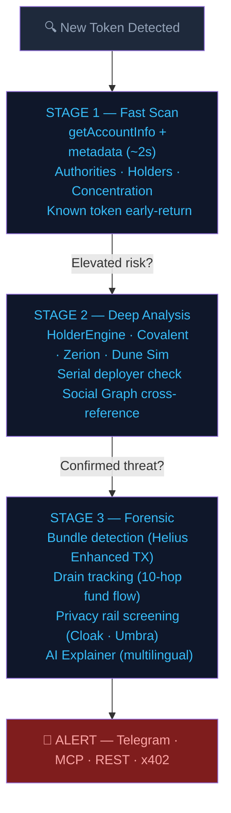

# SolSentry 🛡️
### Solana's Threat Intelligence Graph — Autonomous Operator-Level Detection

> **"RugCheck tells you a fire is burning. SolSentry tells you who lit it — and where they're going next."**

SolSentry is an autonomous threat intelligence system for Solana that tracks **operators**, not just tokens.
While existing tools analyze each token or wallet in isolation, SolSentry maps the people behind the scams — across deployments, across wallets, over time.

🔗 **Telegram:** [t.me/solsentryai](https://t.me/solsentryai)
🔗 **X/Twitter:** [@solsentryapp](https://x.com/solsentryapp)
🔗 **Live API:** [api.solsentry.app](https://api.solsentry.app/v1/stats)
🔗 **NPM:** [@solsentry/mcp](https://www.npmjs.com/package/@solsentry/mcp)
🔗 **Hackathon:** Colosseum Frontier 2026 · [Arena profile](https://arena.colosseum.org/projects/explore/solsentry-3)

---

## The Problem

Serial scam operators on Solana deploy dozens of rug pulls using different wallets, rotating bot clusters, and paid KOL networks. Each new token looks clean on launch.

Existing tools analyze tokens in isolation — RugCheck flags insider holders within a single token. SolScanner maps wallet connections when you ask. ChainAware scores individual wallet fraud probability. But nobody connects a serial deployer's latest token to their previous attacks.

The gap isn't token-level detection — it's **cross-attack operator intelligence**.

---

## How It Works



---

## Integrate in 30 seconds

The REST API is live at `api.solsentry.app`. No install required:

```bash
# Is this token risky?
curl https://api.solsentry.app/v1/token/<mint> | jq

# Who's this developer? (case study: 4kxscute — 2,352 rugs / 2,532 tokens / 92.9%)
curl https://api.solsentry.app/v1/operator/4kxscuteRLQdNiTXA33YYsvywAPNA6DQTifswxjL5pH1 | jq

# Trace stolen funds across up to 10 hops
curl https://api.solsentry.app/v1/drain-trace/<victim-wallet> | jq

# Live metrics — accuracy, resolve rate, runtime
curl https://api.solsentry.app/v1/stats | jq
```

**For AI agents (Claude Desktop / Cursor / Claude Code):**

```bash
npx @solsentry/mcp
```

Point your MCP-compatible client at `@solsentry/mcp` — tools become available: `check_token`, `check_operator`, `get_top_operators`, `get_network_stats`, `explain_risk`, plus more.

Source: [`solsentry/solsentry-mcp`](https://github.com/solsentry/solsentry-mcp) · [npm page](https://www.npmjs.com/package/@solsentry/mcp)

**Endpoints (REST)** include `/v1/operator/{wallet}`, `/v1/operator/{wallet}/network`, `/v1/operator/{wallet}/timeline`, `/v1/token/{mint}`, `/v1/top-operators`, `/v1/alerts/recent`, `/v1/clusters`, `/v1/drain-trace/{wallet}`, `/v1/stats`, `/v1/x402/stats`, plus `/health` and `/health/invariants`.

---

## Frontier 2026 — Multi-Source Data Layer (last 7 days)

What shipped during the Frontier hackathon window:

| Integration | Status | Module | What it adds |
|---|---|---|---|
| **Dune Sim SVM API** | Production | `clients/dune_sim.py` | Alternative tx history source (1,824 LOC of consumers in `forensics/`) |
| **Covalent / GoldRush** | Deployed VPS | `clients/covalent.py` | USD-denominated wallet value + spam classification + cross-chain ready |
| **Zerion CLI** | Deployed VPS | `clients/zerion.py` | Autonomous-agent enrichment — multi-chain portfolio + PnL via shell command |
| **RPC Fast** | Deployed VPS | `clients/rpc/pool.py` | Tier-0 round-robin peer in our 11-endpoint RPC pool |
| **Cloak shielded transfers** | Scaffold + rapport | `clients/cloak.py` + `integrations/cloak/` | "Privacy without impunity" — operator-screen before private transfer |
| **Umbra privacy rail** | Scaffold | `clients/umbra.py` + `integrations/umbra/` | Second privacy rail, same operator-screen substrate (rail-agnostic) |
| **x402 payment enforcement** | Production | `integrations/mcp/x402.py` | Mainnet-ready paid endpoints + pay-per-call rail for Cloak/Zerion |
| **Self-heal pipeline** | Production | `brain/self_heal.py` | 2,400+ auto-repair attempts on missing dev_wallet / token symbol |

**Multi-source enrichment** runs in every `WalletAssetClient.get_or_refresh()` call — Helius DAS (primary), then Covalent (USD value), then Zerion (multi-chain PnL). Each data source contributes independently; pipeline survives single-source failures.

---

## Case Study — Operator 4kxscute

SolSentry's hunter agents were already tracking deployer wallet `4kxscute` as part of a **coordinated bot cluster** — wallets sharing SOL funding sources and executing same-block buy patterns across multiple tokens.

When 4kxscute deployed a new token, the hunter fired instantly:

| Detail | Value |
|---|---|
| Risk Score | **CRITICAL** (52/100 base, +25 SERIAL boost) |
| Holders at deploy | 1 |
| Top Holder Ownership | 100% |
| Flags | MINT_AUTHORITY_ENABLED, FREEZE_AUTHORITY_ENABLED, TOP_HOLDER_OWNS_100%, VERY_FEW_HOLDERS |
| Detection method | Hunter agent already tracking operator + auto-scan on new deploy |

**No other tool connected this deploy to the operator's previous activity.**
SolSentry already knew who he was.

### Live Alert Output


> Real output from SolSentry's Telegram alert system. Hunter tracking
> operator `4kxscute` auto-triggered a scan on the new deployment —
> returning CRITICAL with all critical flags active.

### Current status (May 12, 2026)

- **2,352 confirmed rugs / 2,532 total tokens / 92.9% rug rate**
- Risk level: **CRITICAL** — tags `fast_deployer`, `rebrand_artist`
- **Zero indexed public record** existed for this wallet anywhere — Twitter/X, Reddit, RugCheck, GoPlus, Nansen, Arkham — until SolSentry tagged the operator
- Co-occurs across dozens of bot clusters; a small set of wallets appears in every cluster — the permanent coordination core

SolSentry detected this by watching the operator, not the token. Every individual mint had clean on-chain metadata — token-centric tools saw nothing wrong with each of the 2,532 mints in isolation.

---

## Current Metrics (May 12, 2026)

| Metric | Value | Source |
|---|---|---|
| Token scans executed | **51,404** | `GET /v1/stats` |
| Prediction accuracy | **88.1%** | `was_correct=True / resolved` |
| Resolve rate | **93.0%** | `resolved / total_predictions` |
| False positives at CRITICAL risk | **0** | canonical across all resolved predictions |
| Serial deployers identified | **1,279** | `total_rugs ≥ 2 OR total_tokens ≥ 5` |
| Operators mapped | **5,512** | `operator_profiles.json` |
| Confirmed rugs (cumulative) | **18,987** | aggregate across operators |
| HIGH-risk alerts emitted | **33,441** | alert log |
| Bot clusters identified | **6,994** | `intelligence.json` |
| Wallets profiled | **38,141** | `wallet_profiles` |
| Wallets with confirmed rugs | **5,626** | `GET /v1/stats` |
| RPC endpoints | **11** (Helius ×7, Alchemy ×3, RPC Fast ×1) | `clients/rpc/pool.py` |
| Tests passing | **1,495+** | `pytest tests/ -q` |
| Runtime (continuous mainnet) | **28+ days** | uptime since deploy |
| ALife feedback loops | ✅ Consciousness + MetaLearning | `core/alife/` |

> **On accuracy:** 88.1% reflects **zero confirmed false positives in the CRITICAL band** — every incorrect prediction is a false negative (stealth rugs that launched with clean on-chain metrics and evaded early detection). The system never cries wolf.

Live-at-all-times: `curl https://api.solsentry.app/v1/stats` · health: `curl https://api.solsentry.app/health/invariants`

---

## ALife Agent Ecosystem

SolSentry uses **Artificial Life principles** — inspired by Tierra, Avida, and Conway's Game of Life — to evolve its detection agents autonomously.

- **7-gene DNA** per agent (spawn_threshold, max_hunters, risk_weight, evolution_interval, etc.)
- **Fitness tracking** — agents that predict accurately gain energy and reproduce
- **Genetic mutation** — 30+ real mutations recorded with autonomous timestamps
- **Natural selection** — ineffective agents are culled at 2x population cap
- **Energy metabolism** — -0.3 per tick, births cost 15 energy
- **MetaLearning** — regime-aware self-tuning (bull/chop/crash), blend rate 0.1
- **DNA snapshots** — every prediction is tagged with the scanner's parameters at prediction time, enabling regime-accurate back-testing

This isn't marketing: `genome.json` contains recorded mutations showing parameter changes like `spawn_threshold` evolving 70 → 95 and `max_hunters` 10 → 30.

---

## Social Graph of Scam

Three entity types linked across every scan:

| Entity | Description | Count |
|---|---|---|
| **OperatorProfiles** | Serial deployer identities tracked across wallets | 5,512 operators · 38,141 wallets |
| **BotClusters** | Coordinated wallet groups (same-block buys, shared funding) | 6,994 clusters |
| **ShillNetworks** | KOL-to-operator connections via early-buy patterns | KOL graph tracked |

Every scan cross-references the graph. The more the system scans, the harder it is for operators to hide behind new wallets.

---

## Competitive Landscape

| Capability | RugCheck | SolScanner | ChainAware | Blockaid | **SolSentry** |
|---|:---:|:---:|:---:|:---:|:---:|
| Token-level analysis | ✅ | — | — | ✅ | ✅ |
| Wallet graph visualization | ❌ | ✅ | ❌ | ❌ | 🔜 |
| Per-wallet fraud scoring | ❌ | ❌ | ✅ | ❌ | ✅ |
| Transaction simulation | ❌ | ❌ | ❌ | ✅ | ❌ |
| **Operator tracking (cross-attack)** | ❌ | ❌ | ❌ | ❌ | ✅ |
| **Serial deployer detection** | ❌ | ❌ | ❌ | ❌ | ✅ |
| Social graph mapping | ❌ | ❌ | ❌ | ❌ | ✅ |
| Bot cluster fingerprinting | ❌ | ✅ | ❌ | ❌ | ✅ |
| KOL-operator correlation | ❌ | ❌ | ❌ | ❌ | ✅ |
| Autonomous detection (24/7) | ❌ | ❌ | ❌ | ✅ | ✅ |
| ALife agent evolution | ❌ | ❌ | ❌ | ❌ | ✅ |
| Drain flow tracking | ❌ | ✅ | ❌ | ❌ | ✅ |
| **Public MCP integration for AI agents** | ❌ | ❌ | ❌ | ❌ | ✅ |
| **Public resolve rate + accuracy metrics** | ❌ | ❌ | ❌ | ❌ | ✅ |
| **Multi-source data layer** (Helius + Dune + Covalent + Zerion) | ❌ | ❌ | ❌ | ❌ | ✅ |
| **Privacy-rail-agnostic operator screen** (Cloak + Umbra) | ❌ | ❌ | ❌ | ❌ | ✅ |
| **Cross-chain investigation ready** | ❌ | ❌ | ❌ | ❌ | ✅ |

> **SolScanner** shows you the graph when you ask. **SolSentry** builds the graph while you sleep.

---

## Where SolSentry fits in the Solana security stack

| Layer | What it covers | Example tools |
|---|---|---|
| Token classification | Single mint at a time | RugCheck, GoPlus |
| Wallet classification | Single wallet at a time | Webacy, Chainabuse |
| **Operator intelligence** | **The human/wallet cluster behind N tokens, over time** | **SolSentry** |
| Compliance | KYC, sanctions, AML | Chainalysis, TRM |

The operator-intelligence layer was missing. SolSentry sits below RugCheck/Webacy in the data flow — they classify the artifacts, we classify the deployers. Cross-attack memory is what makes the difference.

---

## Market opportunity

**TAM** — every Solana wallet interaction needing operator-risk pre-check:
- $125M ARR consumer end (25M wallet MAUs × $5/user/year analog)
- $30M–$150M ARR B2B end ($600B annualized DEX volume × 1–5 bps fraud-tool benchmark)

**SAM** — Solana-native integrations reachable in 18 months:
- 3 major wallets + top 5 trading bots + 2 aggregators
- $600K–$6M ARR at $0.001–$0.01 per operator check, 50M checks/month

**SOM** — 12-month capture at 10–25%:
- Conservative: $600K ARR · Target: $1.5M ARR · Stretch: $3M ARR

These are floor numbers, not the moonshot. Consistent with Helius's early traction trajectory.

---

## Repos & Packages

| Resource | Role |
|---|---|
| **[solsentry/solsentry-docs](https://github.com/solsentry/solsentry-docs)** | This repo — public showcase + narrative |
| **[solsentry/solsentry-app](https://github.com/solsentry/solsentry-app)** | Next.js 15 web app — landing, operator lookup, x402 dashboard |
| **[solsentry/solsentry-mcp](https://github.com/solsentry/solsentry-mcp)** | Public source — MCP server + TypeScript SDK + Claude Skills bundle |
| **[@solsentry/mcp](https://www.npmjs.com/package/@solsentry/mcp)** | npm package — MCP server for AI agents (Claude / Cursor / Claude Code) |
| **api.solsentry.app** | Live REST API — 11 endpoints, free read access |
| **[solsentry/solsentry-nansen-cli](https://github.com/solsentry/solsentry-nansen-cli)** | CLI tool — Drift Protocol $285M hack investigation |
| **[solsentry/thegarage](https://github.com/solsentry/thegarage)** | PFP/banner generator for Superteam Brasil's THE/GARAGE cohort |

The **detection engine**, **risk scoring**, **ALife loop**, and **operator dataset** are not in any public repo by design — this is the standard winner pattern across Solana security products (Blockaid, GoPlus, Webacy): public client, private engine.

Hackathon judges + review partners get access on request — contact `hello@solsentry.app`.

---

## Technical Stack

- **Language:** Python 3 (full async architecture)
- **RPC pool:** 11 endpoints — Helius (7 keys), Alchemy (3 keys), RPC Fast (Frontier 2026)
- **Data sources:** Helius DAS + Enhanced TX · Dune Sim · Covalent/GoldRush · Zerion CLI · DexScreener · InsightX · Nansen · Jupiter
- **AI:** Claude Sonnet (multilingual risk explainer)
- **Privacy rails:** Cloak SDK + Umbra SDK (rail-agnostic operator screen)
- **Payment rails:** x402 (mainnet-ready paid endpoints + agent pay-per-call)
- **Delivery:** Telegram Bot API · REST · MCP · dashboard v2
- **Testing:** 1,495+ passing tests
- **Deploy:** Hetzner CPX21 · systemd · 3 services · 28+ days continuous
- **ALife:** Consciousness + MetaLearning wired · DNA snapshots · hunters_archive
- **Self-heal:** 2,400+ auto-repair attempts on missing data

---

## Roadmap

**Now → Frontier deadline (May 12, 2026):**
- ✅ Multi-source data layer (Helius + Dune Sim + Covalent + Zerion)
- ✅ Two privacy rails wired (Cloak + Umbra)
- ✅ 11-endpoint RPC pool with health-aware load balancing
- ✅ x402 mainnet enforcement scaffold
- ✅ 10 side-track submissions

**Post-Frontier (May–July 2026):**
- Public dashboard refactor → solsentry.app/v2 with operator graph visualization
- `@solsentry/jupiter-shield` SDK — operator-aware routing for Jupiter Strict Mode v2
- `@solsentry/privacy-shield` SDK — rail-agnostic operator-screen middleware
- Cross-chain investigation walker (Solana → EVM via Covalent + Zerion)
- Pricing tier launch on x402 (`$0.001–$0.01` per `/v1/operator/{wallet}` micropayment)

**Q3 2026:**
- Multi-tenant API + customer-specific scoring deltas
- Phantom / Backpack wallet integration
- 1-2 trading bot integrations (Trojan, BONKbot)
- Audit (target: Adevar Labs, OtterSec, or Neodyme)

**Q4 2026:**
- Wallet Reputation Score API · Copy Trade Safety Filter
- Launchpad Vetting API · On-chain operator oracle

**2027+:**
- Cross-chain operator tracking expansion · Institutional compliance API · Seed round

---

## Built By

**Crash Diniz** — Solo founder and developer.
Self-taught since the early 2000s: Slackware, Unix, Oracle networking. No university, no bootcamp.
Started learning Python last year — 1,495+ tests, full async architecture, 51,000+ mainnet scans, zero confirmed false positives in the CRITICAL band, without a team.

> *"Started learning Python last year" is the setup. The metrics above are the punchline.*

**Looking for:** Frontend dev (React dashboard evolution) · Security researcher · BD/growth

---

*Built for the Colosseum Frontier Hackathon · April–May 2026*
*Powered by Helius · Alchemy · RPC Fast · Triton · Dune · Covalent · Zerion · Claude AI · Hetzner*
*"Nunca estagnar. Sempre evoluir."*
