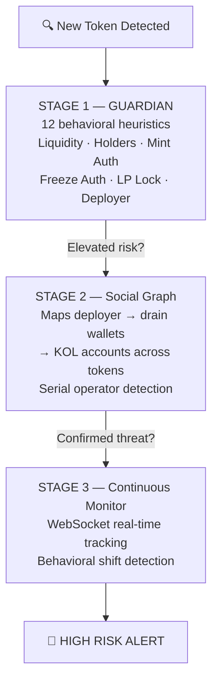

## How It Works

```mermaid
flowchart TD
    A[🔍 New Token Detected] --> B

    B[STAGE 1 — GUARDIAN\n12 behavioral heuristics\nLiquidity · Holders · Mint Auth\nFreeze Auth · LP Lock · Deployer]
    B -->|Elevated risk?| C

    C[STAGE 2 — Social Graph\nMaps deployer → drain wallets\n→ KOL accounts across tokens\nSerial operator detection]
    C -->|Confirmed threat?| D

    D[STAGE 3 — Continuous Monitor\nWebSocket real-time tracking\nBehavioral shift detection]
    D --> E[🚨 HIGH RISK ALERT]
```
